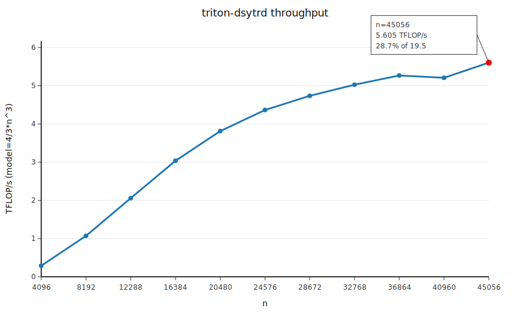

# Triton DSYTRD (A100)

This package contains the Triton 2-stage tridiagonalization path:
- Stage1: `sbr_to_band_dbbr_triton_(update="gemm1")`
- Stage2: `bc_band_to_tridiag_pipeline_gpu_`

## 1) File Roles
- `triton_dsytrd_run.py`: main runnable script (triton-dsytrd + inlined kernels).
- `triton_tridiag_2stage.py`: 2-stage implementation and orchestration.
- `triton_dsytrd.py`: low-level Triton kernels and helpers (dot, axpby, Householder, etc.).
- `triton_dsyr2k.py`: Triton dsyr2k kernel and tuning utilities.
- `check_triton_dsytrd_correctness.py`: correctness check via eigvals(A) vs eigvals(T).
- `bench_triton_dsytrd.py`: fixed-size benchmark + TFLOP/s report.

## 2) Scripts: Arguments and Examples

### Main script: `triton_dsytrd_run.py`
Arguments:
- `--n`: matrix size (default: 16384)
- `--b`: bandwidth (default: 64, must be `<= 64`)
- `--seed`: RNG seed (default: 0)
- `--workers`: number of GPU workers for stage2 (default: 0 = auto/SM count)

Examples:
```
python3 triton_dsytrd_run.py --n 45056 --b 64
PYTORCH_CUDA_ALLOC_CONF=expandable_segments:True python3 triton_dsytrd_run.py --n 45056 --b 64
```

### Correctness: `check_triton_dsytrd_correctness.py`
Arguments:
- `--n`: matrix size (default: 2048)
- `--b`: bandwidth (default: 64, must be `<= 64`)
- `--seed`: RNG seed (default: 0)
- `--workers`: number of GPU workers for stage2 (default: 0 = auto/SM count)

Example:
```
python3 check_triton_dsytrd_correctness.py --n 2048 --b 64
```

### Benchmark: `bench_triton_dsytrd.py`
Arguments:
- `--b`: bandwidth (default: 64, must be `<= 64`)
- `--seed`: RNG seed (default: 0)
- `--workers`: number of GPU workers for stage2 (default: 0 = auto/SM count)

Example:
```
python3 bench_triton_dsytrd.py --b 64
```

Output columns:
`n,b,sbr_ms,stage2_ms,total_ms,TFLOP/s(model=4/3*n^3)`

### Throughput plot


## 3) Machine Environment (this repo)
- GPU: NVIDIA A100-SXM4-40GB (cc 8.0)
- NVIDIA driver: 550.163.01
- CUDA toolkit: 12.4 (nvcc 12.4.99)
- Python: 3.12.7 (Anaconda)
- PyTorch: 2.5.0+cu124
- Triton: 3.6.0
- OS: Ubuntu 22.04
